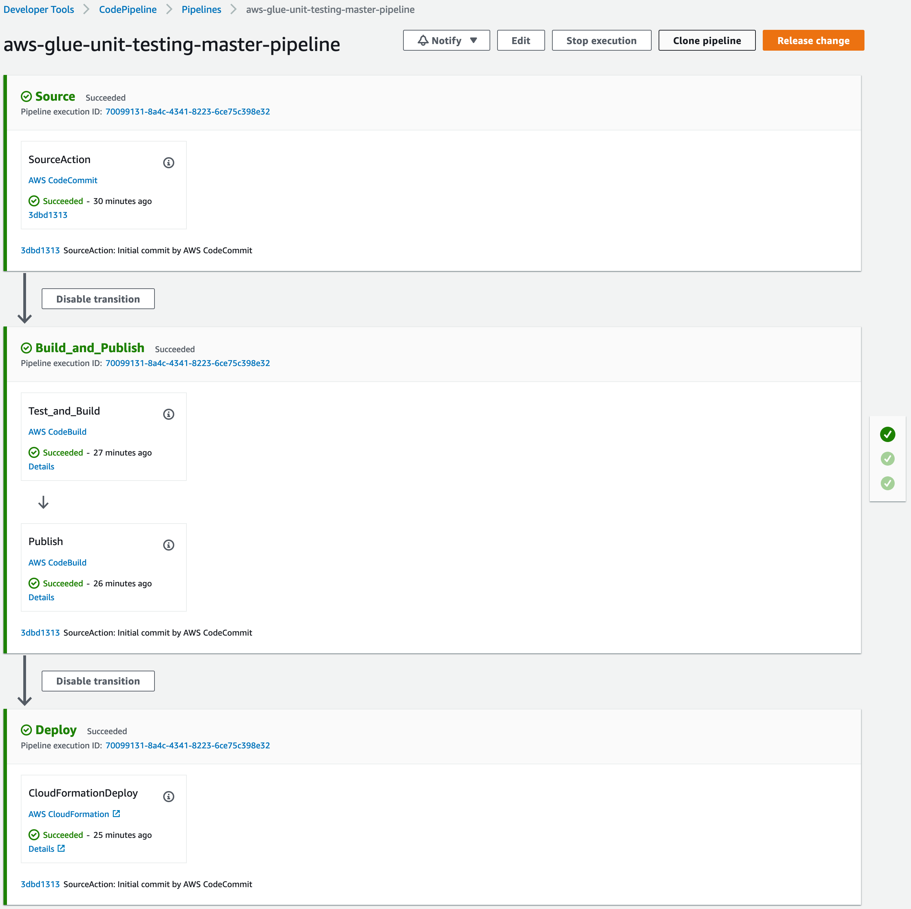

# aws-glue-jobs-unit-testing

This demo illustrates the execution of PyTest unit test cases for AWS Glue jobs in AWS CodePipeline using AWS CodeBuild projects. The solution involves using the container image in Public ECR gallery as the runtime environment for executing the test case in AWS CodeBuild project. The [aws-glue-libs](https://gallery.ecr.aws/amazon/aws-glue-libs) Public ECR repository contains image for all version of AWS Glue.

AWS services used for the CI/CD portion in the solution:

- [AWS Glue](https://aws.amazon.com/glue/)
- [AWS CodeCommit](https://aws.amazon.com/codecommit/)
- [AWS CodeBuild](https://aws.amazon.com/codebuild/)
- [AWS CloudFormation](https://aws.amazon.com/cloudformation/)
- [Amazon Elastic Container Registry](https://aws.amazon.com/ecr/)

The AWS Cloudformation template provided in this sample does not work in ap-southeast-3, af-south-1, ap-northeast-3, ap-southeast-3, me-south-1 and us-gov-east-1 AWS regions due to service limitations.

## Pipeline stages



## Stack deployment

The cloudformation stack for setting up the pipeline can be deployed using Cloudoformation page in AWS Console or using the AWS CLI as shown below

First, zip and upload the sample AWS Glue job and its pytest test cases code to an S3 bucket

```bash
zip -r code.zip src/sample.py src/requirements.txt tests/*.py deploy/*.yml
```

```bash
aws s3 cp code.zip s3://aws-glue-artifacts-us-east-1/
```

Trigger the cloudformation stack creation pointing to that S3 bucket zip.

```bash
aws cloudformation create-stack --stack-name glue-unit-testing-pipeline --template-body file://pipeline.yml --parameters ParameterKey=ApplicationStackName,ParameterValue=glue-codepipeline-app ParameterKey=BucketName,ParameterValue=aws-glue-artifacts-us-east-1 ParameterKey=BranchName,ParameterValue=master ParameterKey=CodeZipFile,ParameterValue=code.zip ParameterKey=RepositoryName,ParameterValue=aws-glue-unit-testing ParameterKey=TestReportGroupName,ParameterValue=glue-unittest-report --capabilities CAPABILITY_NAMED_IAM
```

## Components details

[deploy/template.yml](deploy/template.yml) - AWS Cloudformation template for demonstrating the deployment of AWS Glue job and related resources.

[src/sample.py](src/sample.py) - Python code for a sample AWS Glue job to transform data in parquet files in S3 bucket.

[src/requirements.txt](src/requirements.txt) - Simple text file containing AWS Glue job's dependencies for use by Python package manager Pip.

[tests/conftest.py](tests/conftest.py) - PyTest confgiuration for initializing Glue context and Spark session

[tests/test_sample.py](tests/test_sample.py) - PyTest test cases for the AWS Glue job [src/sample.py](src/sample.py).

[code.zip](code.zip) - Compressed ZIP file containing the `src`, `tests` and `deploy` folder.

[pipeline.yml](pipeline.yml) - AWS Cloudformation template for deploying pipeline to build, test and deploy the AWS Glue job in `src` folder.

## License

This library is licensed under the MIT-0 License. See the [LICENSE](LICENSE) file.
